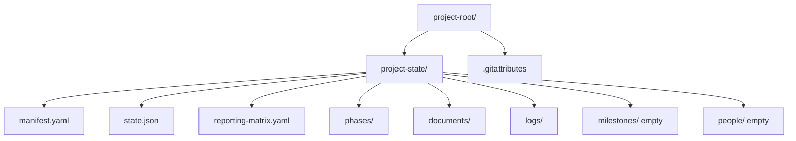

# Project Scaffolder

> **When to use — full trigger description.** The frontmatter carries a short, trigger-first
> description so all of the suite's skills fit Claude Code's skill-listing budget (see
> docs/SKILL-SPEC.md, *Description budget*). The complete version, kept here:
>
> One-shot initializer for a new project-state/ facility. Use this skill when starting a brand-new project of any kind — software, campaign, event, operating cycle, grant, client engagement — scaffolds the directory tree, manifest, phase manifests, logs, README/SCHEMA/CONCURRENCY/SKILLS docs — and when asked to 'set up a new project', 'create a new project-state', 'scaffold a project', 'initialize project-state', 'start a new funded project', 'bootstrap a grant project', 'new consortium project', 'create the state folder for [project]', 'init project-state in this folder'. Asks what kind of work it is, who hears about it and how the work moves, then seeds the manifest, reporting matrix and draft milestones/risks from the chosen packs (seed-pack, adopt-seeds). Follow-up work (milestone seeding from proposal, people seeding from MPA) is handed off to the other project-* skills.

## Purpose

Stand up a fresh `project-state/` in a new working directory. Ensures the facility starts correctly-shaped so the other `project-*` skills can operate.

Used once per project at kickoff. The experience runs as a 6-step wizard with a post-confirm build step.

## Trigger phrases

- "set up a new project"
- "scaffold a project"
- "initialize project-state" / "init project-state"
- "create a new project-state"
- "start a new funded project" / "bootstrap a grant project"
- "new consortium project"

---

## Presentation Protocol

project-state runs on two surfaces. Detect and adapt before Step 1.

### Surface detection

Check the runtime context:
- **Claude Coworker / claude.ai web** → HTML artifact mode. Each wizard step is a rendered HTML artifact with real buttons.
- **Claude Code (CLI)** → Markdown mode. Each step uses Mermaid blocks, tables, and bold numbered options.

Default to HTML artifact mode. If artifact rendering is not available, fall back to markdown mode automatically.

### Design system (HTML artifact mode)

All HTML artifacts share this design system. Generate consistent, minimal UI:

```
Container:  font-family: system-ui; max-width: 680px; margin: 0 auto; padding: 24px
Colors:
  primary-green:    #22c55e  (active step, confirm button, selected border)
  primary-green-bg: #f0fdf4  (selected card background)
  text-main:        #111827
  text-muted:       #6b7280
  border:           #e5e7eb
  badge-production: bg #dcfce7  text #166534
  badge-starter:    bg #fef9c3  text #a16207
  badge-new:        bg #dbeafe  text #1e40af

Components:
  ProgressBar     — flex row of N divs (height 4px, border-radius 2px).
                    Completed steps = primary-green, pending = border-color.
  StepLabel       — "Step N of 6 — [Name]" in 12px text-muted, margin-bottom 20px.
  SectionTitle    — 18px font-weight 600, margin-bottom 4px.
  SectionSubtitle — 14px text-muted, margin-bottom 20px.
  OptionCard      — padding 12px 16px, border 1px solid border-color, border-radius 8px,
                    background #fff, cursor pointer, width 100%, text-align left,
                    display flex, justify-content space-between, align-items center.
                    Left: title (14px 600) + subtitle (13px text-muted, margin-top 2px).
                    Right: badge pill (11px, padding 2px 8px, border-radius 12px).
  SelectedCard    — OptionCard with border 2px solid primary-green, background primary-green-bg.
  NavRow          — display flex, justify-content space-between, margin-top 24px.
                    Back button: outline style (border border-color, bg #fff).
                    Primary button: background primary-green, color #fff, border none,
                    padding 10px 20px, border-radius 8px, font-weight 600.
  FormField       — label (12px text-muted font-weight 500) + input (full width,
                    padding 8px 12px, border 1px border-color, border-radius 6px,
                    font-size 14px, margin-top 4px, margin-bottom 16px).
  ToggleCard      — OptionCard with a toggle pill on the right instead of a badge.
                    Toggle on: background primary-green. Toggle off: background border-color.
  SummaryRow      — display grid, grid-template-columns 160px 1fr, gap 8px,
                    padding 10px 0, border-bottom 1px border-color, font-size 14px.
                    Label: text-muted. Value: text-main font-weight 500.
  StatusRow       — 3-column (icon 24px | filename | note text-muted). Icon: ✅ or ⬜.
```

Mermaid in HTML artifacts: use a `<pre class="mermaid">` block and load mermaid.js from CDN:
```html
<script src="https://cdn.jsdelivr.net/npm/mermaid/dist/mermaid.min.js"></script>
<script>mermaid.initialize({startOnLoad:true, theme:'neutral'})</script>
```

Button click behaviour: clicking any option or the primary button sends a message back to Claude with the selection. Claude then generates the next step artifact.

### Markdown mode (Claude Code)

Each step begins with a progress line:
```
── Step N of 6: [Step Name] ──────────────────────────────────────
```

If the step has a diagram, emit a `\`\`\`mermaid` block immediately after the progress line.

Options are presented as a markdown table with bold `**N**` in the first column. The final line of each step is a prompt:
```
> Type a number (or numbers separated by spaces) to select:
```

---

## Wizard Steps

Run steps 1–6 in sequence, one at a time. Wait for the user's response before generating the next step. Do not skip steps. Do not write any files until the user confirms in Step 6.

---

### Step 1: What kind of project, and who hears about it

**Purpose:** Answer two of the three project-type questions (`docs/PROJECT-TYPES-SPEC.md` §3): the
**work type** (one primary `axis: work` pack) and **accountability** (zero or more
`axis: accountability` packs). The third — rhythm — is Step 2's preset. Packs seed the reporting matrix,
the draft milestones and risks, and configure the profile-driven skills.

**Build the cards from pack manifests — never from a table in this file.** Read every
`packs/*/manifest.yaml` and keep those with `picker.listed: true`. Group by `pack.axis`; show
`picker.label` as the card title, `picker.blurb` beneath it and `pack.maturity` as the badge. Packs with
`picker.listed: false` (e.g. `open-source-community`) appear only under a collapsed **Advanced** group,
marked *thin*. `axis: capability` packs never appear. Every row of `PROJECT-TYPES-SPEC` §2.5 was a front
door keeping its own copy of this list.

**HTML artifact:**
- ProgressBar (1 of 6 active)
- StepLabel
- SectionTitle: "What is this project trying to make happen?"
- One OptionCard per listed `axis: work` pack — single-select; this becomes `project.kind`. "General
  project" (`work-general`) is a real choice, not a failure path.
- SectionTitle: "Who needs to hear how it's going?"
- One OptionCard per listed `axis: accountability` pack — multi-select. Cards whose manifest sets
  `picker.preselected: true` (`sponsor-internal`, decision D3) start selected. Add a "Just me" card that
  deselects all of them.
- Collapsed **Advanced**: unlisted packs (badge *thin*), and a toggle to add *secondary* work packs —
  they contribute matrix entries and seeds but never the preset (decision D4).
- Note below cards: "**SR&ED is not in this list** — it is a capability, not a pack. It brings its own
  entity kinds, validator and bundled pack, and needs a fiscal year end this step doesn't ask for.
  Finish here, then run `/sred-onboarding`."
- NavRow: no Back | Continue →

**Markdown output** (rows generated from manifests; this is the shape, not the list):
```
── Step 1 of 6: Project type ────────────────────────────────────

What is this project trying to make happen? (pick one)

| # | Work type          | Best for                                              |
|---|--------------------|-------------------------------------------------------|
| 1 | <picker.label>     | <picker.blurb>                                        |
| … |                    |                                                       |

Who needs to hear how it's going? (pick any; ✓ = pre-selected)

| # | Accountability               | Best for                                   | Maturity |
|---|------------------------------|--------------------------------------------|----------|
| a | ✓ <picker.label>             | <picker.blurb>                             | <badge>  |
| … |                              |                                            |          |
| z | Just me                      | No one outside the team                    | —        |

> Type a number and letters (e.g. "3 a c"), or "advanced" for more:
```

Write the choices as `project.kind: <work pack id>` and `project.packs_loaded: [<work pack>,
<accountability packs…>]` — the work pack first.

---

### Step 2: Phase Selection

**Purpose:** Set the starting phase. The phase determines which gate criteria are active and which phase manifests are marked CURRENT.

**`phases.lifecycle` — write only what the pack settles, and never ask here.** Scaffolding is not the
moment to raise a question the operator cannot yet answer; `project-onboarding` Q1.7 asks it properly,
pre-filled from the same pack data.

Read `defaults.lifecycle` from the manifest of each pack selected in Step 1. Then:

- **Any selected pack declares `terminal`** → write `phases.lifecycle: terminal`. Nothing is being
  guessed: the pack is asserting that projects of its kind end, and for grant packs the preset makes
  `continuous` structurally impossible anyway.
- **Packs declare `continuous`, or disagree, or declare nothing** → **leave it unset.** A `continuous`
  pack default is a *suggestion*, and scaffold time is the point of least information — writing it here
  would create `increments/` on a facility nobody has confirmed continues.
- **No pack selected** → leave it unset.

Do not hardcode a pack-to-lifecycle table in this skill. The mapping lives in pack manifests, per the
packs-configure-not-code principle; `FB-003` is what happens when pack knowledge is encoded in a skill
instead. Unset means terminal, is permanently valid, and is never warned about, so leaving it is always
the safe answer — and the post-closeout diagnostic asks at the moment the answer is actually knowable.

Spec: `docs/CONTINUOUS-LIFECYCLE-SPEC.md` §4.1.

**`phases.preset` — write it, always.** This is the key FB-003 is about: five presets shipped in
`templates/phase-presets/` and nothing ever wrote the manifest key that selects one, so choosing a
ladder meant hand-editing YAML for ten weeks. Resolution order:

1. The intake record's `phases.preset`, when called from `project-onboarding` Q1.9.
2. The **primary work pack's** `defaults.preset` (the pack `project.kind` names). With no work pack
   loaded, an accountability pack's `defaults.preset` pre-fills instead (e.g. `pic-pcais` →
   `grant-default`). Always presented as a confirmation, never written unseen.
3. Otherwise ASK. This is the interactive front door and a one-line question is cheap; a facility with
   no ladder is not.

Never leave it unset. Unlike `phases.lifecycle`, where unset is a permanently valid answer meaning
terminal, an unset preset means there is no phase ladder to be in.

**`automation.timezone` — write it, and never invent it.** `templates/manifest-v2.yaml` has marked
this REQUIRED since it shipped while shipping the value as `~`, and no skill collected it (FB-002).
Resolution order:

1. The intake record's `automation.timezone`, from `project-onboarding` Q1.8.
2. Otherwise ASK for an IANA name. The host machine's zone may be offered as a suggestion to confirm,
   never written unseen — the facility's timezone is a property of the PROJECT, not of whoever ran the
   command, and a project worked on from two machines in two zones would silently reschedule itself.

Do not write `~`, do not default to UTC. `project-automator` now refuses to compile a schedule without
it, because the window above is local time and a guessed zone fires the nightly jobs at the wrong hour
— confidently wrong beats not starting, which is why the refusal is the correct behaviour and this
question is the thing that stops anyone meeting it.

Both keys are ruled in decision `2026-08-21-twelve-rulings-facility-contract`, items 10 and 11.


**The rhythm question, when nothing settled the preset.** If neither the intake record nor the primary
work pack's `defaults.preset` settles it, ask in plain words (`PROJECT-TYPES-SPEC` §6.1):

| Answer | Preset |
|---|---|
| "In sprints or iterations" | `agile-default` |
| "Through stages, with sign-off between them" | `stage-gate-default` |
| "Toward a fixed date" | `countdown-default` |
| "In a repeating cycle" | `cycle-default` |
| Advanced | `grant-default`, `client-engagement-default`, `waterfall-default`, `open-source-default`, custom |

**`phases.anchor_date` — ask when the preset requires it.** A preset that declares `requires:
[anchor_date]` (`countdown-default`) cannot be written without it: ask for the launch or event date and
write it with the preset. Then ask each `asks:` entry declared by the loaded packs' manifests, writing
each answer to its dotted `key`; skip an optional one the operator leaves blank. Never invent an answer.

**Starting phase — the options are the preset's own phases.** Read `phases:` from
`templates/phase-presets/<preset>.yaml` and offer each phase's `id` and `label`, defaulting to the
first. (This step used to hardcode the grant ladder — LOI / Approval / Planning / Execution — for every
project, whatever its preset.) For `grant-default` keep the old default of `03-planning` when the award
is confirmed.

**HTML artifact:**
- ProgressBar (2 of 6 active)
- Mermaid diagram of the resolved preset's phases (`id` + `label`, joined in order; a `cycles_back_to`
  edge drawn back), the default starting phase highlighted:
  ```mermaid
  graph LR
    P1["01 Plan ◀"] --> P2[02 Build-out] --> P3[03 Final countdown] --> P4[04 Live] --> P5[05 Wrap]
    style P1 fill:#22c55e,color:#fff,stroke:#16a34a
  ```
- SectionTitle: "Which phase are you starting in?"
- One OptionCard per phase of the preset, `gate_out` as the "done when" line.
- NavRow: ← Back | Continue →

**Markdown output** (generated from the preset; `countdown-default` shown):
```
── Step 2 of 6: Phase Selection ─────────────────────────────────

Preset: countdown-default (from work-event)     Anchor date: 2027-03-12

| # | Phase                  | Done when                                               |
|---|------------------------|---------------------------------------------------------|
| 1 | 01 — Plan ✓            | Brief approved, date fixed, budget and owners agreed    |
| 2 | 02 — Build-out         | Everything booked, made or confirmed                    |
| 3 | 03 — Final countdown   | Readiness check passed; run of show locked              |

> Type a number [default: 1]:
```

---

### Step 3: Project Identity

**Purpose:** Collect project name, funder, program, PI/PL, and dates. These seed `manifest.yaml`.

**HTML artifact:**
- ProgressBar (3 of 6 active)
- SectionTitle: "Tell me about the project"
- FormFields in two columns where space allows:
  - Project short name (slug, e.g. `atlas`)
  - Project long name (full title)
  - Funder / sponsor organization
  - Program / contract name
  - Project Lead name + email
  - Project start date (date input)
  - Project end date (date input, optional)
  - Proposal / LOI document path (optional, file path hint)
- NavRow: ← Back | Continue →

**Markdown output:**
Present questions one at a time in sequence. After each response, confirm and move to the next:
```
── Step 3 of 6: Project Identity ────────────────────────────────

I'll ask a few questions about the project. Answer each in turn.

  1. Project short name (used as slug, e.g. atlas):
```
Then after each answer: `Got it. Next:`

---

### Step 4: Consortium & Sharing

**Purpose:** Capture consortium members, the Project Lead organization, and the team sharing model.

**HTML artifact:**
- ProgressBar (4 of 6 active)
- SectionTitle: "Consortium and team sharing"
- Sub-section: **Lead organization** — FormField (org name)
- Sub-section: **Consortium members** — repeating group:
  - Org name + role (member / partner / advisor) + contact email
  - "+ Add member" button
- Sub-section: **Team sharing model** — 3 OptionCards:

  | Model | Description |
  |-------|-------------|
  | **Git** *(recommended)* | `project-state/` lives in a git repo. `project-git` handles checkpointing and sync. Append-only logs merge without conflicts. |
  | **Shared drive** | Dropbox / Google Drive / OneDrive. No git. Advisory lockfiles handle concurrency. |
  | **Single user** | One user, local only. No sharing needed. |

- NavRow: ← Back | Continue →

**Markdown output:**
```
── Step 4 of 6: Consortium & Sharing ────────────────────────────

  Lead organization:
  Consortium members (org, role, email — one per line, blank to finish):

  Sharing model:
  | # | Model         | Description                                      |
  |---|---------------|--------------------------------------------------|
  | 1 | Git ✓         | project-state/ in a git repo — recommended       |
  | 2 | Shared drive  | Dropbox / GDrive / OneDrive, no git              |
  | 3 | Single user   | Local only                                       |

> Sharing model [default: 1]:
```

---

### Step 5: Surfaces

**Purpose:** Configure which external surfaces the project uses. Surface config is stored in `manifest.yaml:surfaces` and read by `project-notifier`.

**HTML artifact:**
- ProgressBar (5 of 6 active)
- SectionTitle: "Which surfaces does the team use?"
- SectionSubtitle: "You can enable or reconfigure these at any time in manifest.yaml."
- 4 ToggleCards, all off by default:

  | Surface | What it does |
  |---------|-------------|
  | **Slack** | Posts status updates and alerts to configured channels |
  | **Gmail** | Creates drafts — never auto-sends |
  | **Google Calendar** | Proposes meeting holds and deadline reminders |
  | **scsiwyg blog** | Publishes project narrative posts through a review queue |

- Each toggle card, when enabled, expands a FormField for the key config value (channel name / calendar ID / site slug)
- NavRow: ← Back | Continue →

**Markdown output:**
```
── Step 5 of 6: Surfaces ────────────────────────────────────────

Which surfaces does the team use? Toggle on/off.

| # | Surface          | Status | What it does                              |
|---|------------------|--------|-------------------------------------------|
| 1 | Slack            | [ ]    | Posts updates to a channel                |
| 2 | Gmail            | [ ]    | Creates drafts (never auto-sends)         |
| 3 | Google Calendar  | [ ]    | Proposes meeting holds                    |
| 4 | scsiwyg blog     | [ ]    | Publishes posts through a review queue    |

> Type numbers to enable (e.g. 1 2), or press Enter to skip:
```

---

### Step 6: Review & Confirm

**Purpose:** Show the complete configuration before writing anything. Nothing touches the filesystem until the user confirms here.

**HTML artifact:**
- ProgressBar (6 of 6 active)
- SectionTitle: "Ready to scaffold — review before writing"
- SummaryRows covering all collected inputs:
  - Project: [long name] (`[slug]`)
  - Pack(s): [selected packs]
  - Phase: [selected phase]
  - Funder: [funder]
  - Lead org: [lead org]
  - Consortium: [N members]
  - Surfaces: [enabled list]
  - Sharing: [model]
  - Git: Yes — will `git init` + write `.gitattributes` / No — shared drive
- Mermaid preview of what will be created:
  ```mermaid
  graph TD
      root[project-root/] --> ps[project-state/]
      root --> ga[.gitattributes]
      ps --> mf[manifest.yaml]
      ps --> st[state.json]
      ps --> rm[reporting-matrix.yaml]
      ps --> ph[phases/]
      ps --> docs[documents/]
      ps --> logs[logs/]
      ps --> ms[milestones/ — empty]
      ps --> ppl[people/ — empty]
  ```
- NavRow: ← Edit | **Scaffold Now** (primary green)

**Markdown output:**
```
── Step 6 of 6: Review & Confirm ───────────────────────────────

Review your configuration. Nothing is written until you confirm.

  Project:    [long name] ([slug])
  Pack(s):    [packs]
  Phase:      [phase]
  Funder:     [funder]
  Lead org:   [org]
  Consortium: [N members]
  Surfaces:   [enabled]
  Sharing:    [model]
  Git:        [yes/no]



  **1** Confirm and scaffold
  **2** Go back and change something

>
```

---

### Step 7: Build Output (post-confirm)

Triggered immediately after the user confirms in Step 6. Write all files now.

**HTML artifact:**
- Brief animated progress message: "Scaffolding your project..."
- Then replace with result card:
  - SectionTitle: "Project scaffolded ✓"
  - StatusRows for each created file/directory (✅ written / ⬜ empty / ⚠ TODO):

    | Icon | Path | Note |
    |------|------|------|
    | ✅ | `project-state/manifest.yaml` | 3 TODOs remain (MPA date, review designates, funder contacts) |
    | ✅ | `project-state/state.json` | Phase: [selected] |
    | ✅ | `project-state/reporting-matrix.yaml` | Seeded from [pack] defaults (`seed-pack`) |
    | ✅ | `project-state/outbox/queue/*-seed-*` | Draft milestones and risks from the work pack — review, then adopt |
    | ✅ | `project-state/automation/tasks.yaml` | Compiled from matrix by project-automator |
    | ✅ | `project-state/logs/activity.ndjson` | `project.scaffolded` event |
    | ✅ | `.gitattributes` | `merge=union` on logs (if git model) |
    | ✅ | Git repo | Initial commit: "project-state: facility scaffolded — [slug]" |
    | ⬜ | `project-state/milestones/` | Empty — seed with `/project-milestone-manager` |
    | ⬜ | `project-state/people/` | Empty — add via `/project-state` |
    | ⬜ | `project-state/lessons-learned/` | Empty — capture with `/project-lessons`; shape in `templates/lesson-learned.md` |

  - SectionTitle: "What would you like to do next?"
  - 4 OptionCards as next-step buttons:

    | # | Action | Skill |
    |---|--------|-------|
    | 1 | Review the seeded milestones and risks (outbox) | `/project-scaffolder adopt-seeds` after approval |
    | 2 | Add team members | `/project-state` |
    | 3 | Checkpoint to git | `/project-git checkpoint` |
    | 4 | Done for now | — |

**Markdown output:**
```
── Scaffolded ✓ ─────────────────────────────────────────────────

| Status | Path                                        | Note                           |
|--------|---------------------------------------------|--------------------------------|
| ✅     | project-state/manifest.yaml                 | 3 TODOs remain                 |
| ✅     | project-state/state.json                    | Phase: [selected]              |
| ✅     | project-state/reporting-matrix.yaml         | Seeded from [pack] defaults    |
| ✅     | project-state/outbox/queue/*-seed-*         | Draft milestones + risks       |
| ✅     | project-state/automation/tasks.yaml         | Compiled from matrix           |
| ✅     | project-state/logs/activity.ndjson          | project.scaffolded event       |
| ✅     | .gitattributes                              | merge=union on logs            |
| ✅     | Git repo initialized                        | Initial commit made            |
| ⬜     | project-state/milestones/                   | Empty — seed later             |
| ⬜     | project-state/people/                       | Empty — add later              |
| ⬜     | project-state/lessons-learned/               | Empty — capture later          |

Next steps:
  **1** Review seeded milestones/risks   → approve in the outbox, then adopt-seeds
  **2** Add team members                 → /project-state
  **3** Checkpoint to git                → /project-git checkpoint
  **4** Done for now
```

---

## Git initialization

After files are written (Step 7), initialize git if the git sharing model was selected:

1. Run `git rev-parse --git-dir`. If already inside a repo, skip `git init` — only add the `.gitattributes` entry if missing.
2. Run `git init` in the project root (if no repo exists).
3. Write `.gitattributes` to the project root:
   ```
   # project-state git merge configuration
   # Append-only logs: keep all lines from both sides (never a real conflict)
   project-state/logs/*.ndjson merge=union
   ```
4. Stage and commit: `git add . && git commit -m "project-state: facility scaffolded — <project.name>"`

If shared-drive model: skip git entirely. Note in Step 7 output: "Git checkpointing is available if you switch to git sharing later."

---

## Discipline

- **Never write files before Step 6 confirmation.** The entire wizard is read-only until the user confirms.
- **Idempotent, CONDITIONALLY.** Invoked directly with no intake record: if `project-state/` already
  exists, abort before Step 1 with a warning and offer `project-state validate` instead. Called WITH
  an intake record (see "Parameterised invocation" below): **adopt** the existing tree — never
  overwrite, never clear — because re-orientation is a supported path where an existing facility is
  the premise, not a mistake. Same rule and same word as capability `enable` step 5. A blanket abort
  broke `project-onboarding`'s re-orientation flow, which calls this skill in Chapter 8 against a
  facility that already exists (FB-001).
- **Never overwrite existing files.**
- **Atomic failure.** If scaffolding aborts mid-way, clean up anything partially created.
- **Surface-aware.** Detect HTML vs. markdown mode before Step 1 and stay consistent throughout all steps.
- **One step at a time.** Generate one artifact or one markdown step, wait for response, then generate the next. Do not bundle multiple steps.

---

## Parameterised invocation

This skill has two front doors, and only one of them is the wizard.

**Interactive.** A person runs it directly; Steps 1–6 interview them; nothing is written before
confirmation. If `project-state/` exists, it aborts (see Discipline).

**From an intake record.** `project-onboarding` Chapter 8 calls this skill with its captured intake
record as structured input: *"Call `project-scaffolder` with all captured inputs, passing the working
intake record as structured input. Do not re-ask questions that have already been answered."* In this
mode the wizard does not run — every value it would have asked for is supplied — and an existing
`project-state/` is **adopted** rather than refused, because onboarding also serves re-orientation of
a live facility.

This contract existed and worked for months while documented only in the caller. It is written here
because a callee that refuses its own documented caller is not discoverable from either side alone
(FB-001).

### `seed-pack` (supersedes `seed-matrix`)

`project-onboarding` Chapter 8 and Step 7 above call this after the manifest is written. It runs the
deterministic helper shipped with this skill:

```bash
python3 <this skill>/scripts/seed_pack.py seed --state project-state --actor <operator email>
```

1. **Matrix.** Merges `reporting-matrix-defaults.yaml` from every loaded pack into
   `project-state/reporting-matrix.yaml` — primary work pack first. An entry whose `id` already exists is
   left alone: an operator's edit outranks a pack default. Comments and other keys survive.
2. **Seeds.** For each loaded pack that ships `seeds/milestones.yaml` or `seeds/risks.yaml`, queues one
   DRAFT card in `outbox/queue/` with every date expression already resolved against
   `project.start_date`, `project.end_date` and `phases.anchor_date`. A seed whose date is missing is
   queued *undated* and the card names the missing field — it is never dated by guess.
3. **Never** writes a live milestone, risk or KPI (KPI seeds belong to the Goals tab, decision record
   `2026-09-24-project-types-three-axes`), and never seeds a capability pack (its enable step does).

Idempotent: a re-run adds only matrix ids and seed cards that do not exist yet. `--dry-run` prints the
plan and writes nothing. `seed-matrix` remains as an alias for callers that predate seeds: it is
`seed_pack.py seed --no-seeds` — the matrix step only.

### `adopt-seeds <card-id>`

After the operator approves a seed card (it moves to `outbox/approved/`), write what it proposes:

```bash
python3 <this skill>/scripts/seed_pack.py adopt --state project-state --card <card-id> --actor <operator email>
```

Reads the YAML block in the card's artifact — so an operator who edited a date, reworded a title or
deleted a row gets exactly that — and writes `milestones/M<NN>-<slug>.yaml` / `risks/R-<NN>-<slug>.yaml`
numbered after the highest existing id, skipping any slug already present. Refuses a card that is still
queued or was dismissed (review-not-author). Logs `milestone.created` / `risk.created` per entity and
`seeds.adopted` once; marks the card `adopted_at` so a second run writes nothing.

Offer it whenever a seed card is approved: *"You approved the starting milestones — write them now?"*

Each adopted milestone records `seed_due` (its expression) and `seed_basis` (the start, end and anchor
dates it was resolved against). That is what lets `project-milestone-manager reanchor()` move the plan
when an event or launch date slips without touching anything a person has re-dated.

---

## Integration

- **project-state** — all subsequent reads/writes route through it (once scaffolded).
- **project-document-curator** — offered in Step 7 next-steps for proposal ingestion.
- **project-milestone-manager** — offered in Step 7 next-steps for milestone seeding.
- **project-phase-gate** — becomes active once scaffolded.
- **project-git** — git initialization is part of scaffolding; `project-git` handles all subsequent checkpointing, pushing, and syncing.
- **project-onboarding** — the deeper context-gathering experience; runs after scaffolding to fill references/ with goals, examples, and stakeholder context.
